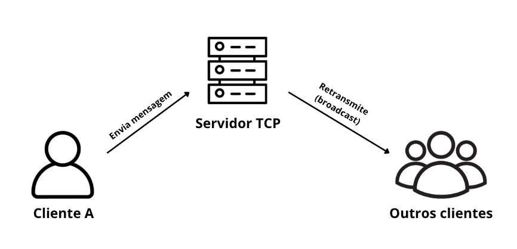

# Servidor de Chat Multiusuário (TCP) - Etapa 2
Aluna: Beatriz Montenegro Maia Chaves 

Matrícula: 20230012233

Este projeto tem como objetivo tem como objetivo desenvolver um servidor TCP concorrente que aceita a conexão de múltiplos clientes. Cada cliente será atendido por uma thread e as mensagens serão retrasmitidas para os demais clientes via broadcast. O diagrama abaixo mostra de forma visual o funcionamento da arquitetura do sistema: 




## Estrutura do repositório

O projeto está organizado nos seguintes diretórios:
- **bin/**: Contém os arquivos executáveis após a compilação
- **build/**: Contém os arquivos objeto (.o)
- **docs/**: Guarda a documentação do projeto (diagramas e relatórios)
- **include/**: Contém os arquivos de cabeçalho(.h) do projeto
- **src/**: Contém todo o código-fonte (.c), subdividido em:
    - **lib/**: Implementação de bibliotecas auxiliares (`server.c`, `cliente.c`, `libtslog.c`)
    - **server/**: Código-fonte principal do servidor (`main_server.c`)
    - **cliente/**: Código-fonte principal do servidor (`main_cliente.c`)
    - **tests/**: Códigos e scripts de teste para validar funcionalidades
- **Makefile**: Script para compilar, testar e limpar o projeto


## Análise do Código

### Biblioteca de logging (libtslog.h)

O sistema de logging é um componente central e foi projetado para ser thread-safe. Isso é crucial, pois múltiplas threads (cada uma representando um cliente) precisarão escrever no mesmo arquivo de log simultaneamente.

- **Mecanismo de Sincronização**: A biblioteca utiliza `pthread_mutex_t` para garantir que toda a operação de escrita no arquivo seja feita de forma segura, assim apenas uma thread por vez tem direito de entrar na seção crítica e escrever a mensagem de log. 

- A biblioteca possui funções simples: `tslog_init()` para inicializar o log, `tslog_log()` para escrever a mensagem de log no arquivo e `tslog_destroy()` para finalizar o logger.

### Biblioteca de servidor (server.h)
O servidor foi projetado para alta concorrência, utilizando pthreads para gerenciar múltiplos clientes de forma eficiente.

- **Modelo de Concorrência**: O servidor opera em um loop principal que aguarda novas conexões com accept(). Para cada cliente que se conecta, uma nova thread é criada com pthread_create() para lidar com toda a comunicação daquele cliente, permitindo que o loop principal continue disponível para aceitar novos clientes, sem bloqueios.

- **Gerenciamento de Clientes**: O servidor mantém uma lista global de clientes conectados. O acesso a esta lista (para adicionar, remover ou enviar para broadcast) é protegido por um pthread_mutex_t, garantindo que as operações sejam atômicas e seguras em um ambiente multithread.

**Ciclo de Vida da Thread do Cliente**  

Cada thread (handle_client) gerencia o ciclo de vida completo de um cliente:

1. Recebe o nome do cliente e o armazena.

2. Adiciona o cliente à lista global (operação protegida por mutex).

3. Anuncia a entrada do novo cliente para todos os outros via broadcast.

4. Entra em um loop para receber as mensagens daquele cliente. Cada mensagem recebida é retransmitida para os demais.

5. Se a conexão for encerrada, a thread remove o cliente da lista global (operação protegida por mutex), anuncia sua saída via broadcast e libera os recursos alocados.

### Biblioteca do cliente (cliente.h)
O cliente foi projetado com uma arquitetura multithread para oferecer uma experiência de uso contínua, responsiva e sem bloqueios.


**Estrutura multithread**  

O cliente utiliza duas threads principais para operar: 

1. **Thread principal**: responsável por capturar a entrada do usuário via terminal e encaminhar as mensagens digitadas para o servidor (`send_messages`).

2. **Thread secudária**: criada para esperar e receber mensagens do servidor (`recived_message`). Essa thread permanece em espera e, assim que uma mensagem chega, exibe-a imediatamente no terminal.

## Como Compilar e Executar

Para compilar e executar o projeto, você pode usar o compilador GCC diretamente ou utilizar o `Makefile` fornecido.

### Compilação com Makefile

1.  Certifique-se de que o arquivo `Makefile` se encontra-se no diretório atual.
2.  Abra o terminal e execute o comando:

    ```bash
    make
    ```
3.  Isso irá gerar todos os executáveis do projeto.


### Execução
A execução requer dois ou mais terminais: um para o servidor e os outros para cada cliente.

1. **Inicie o servidor**: Abra um terminal e execute o servidor.  

```bash
./bin/server
```  

2. **Inicie o cliente**: Abra um novo terminal e conecte-se ao servidor identificando o IP(127.0.0.1)  

```bash
./bin/client 127.0.0.1
```

Você pode abrir vários terminais e executar o comando do cliente em cada um para simular múltiplos usuários.

### Como rodar o script de teste
O projeto inclui um script de teste em BASH que simula múltiplos clientes se conectando, enviando mensagens e se desconectando automaticamente.

1. **Inicie o Servidor** (se ainda não estiver rodando) em um terminal:

```bash
./bin/server
```    

2. **Execute o teste:** Em outro terminal, execute o seguinte comando do `Makefile`:


```bash
make test
```   

O script será executado, e o output de cada cliente simulado será salvo em arquivos individuais dentro do diretório logs/.